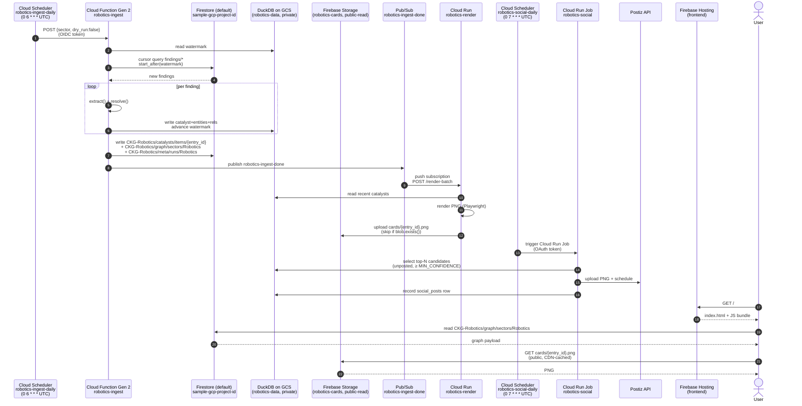

# Technical Spec — Robotics module (Phase 1)

*Reference: `proposal_b.md` for product context. `infra_spec.md` for the local Docker dev stack and GCP target architecture. This document covers the application-level architecture, data flow, and component design as of 2026-04-17.*

---

## 1. System overview

```
┌─────────────────────────────────────────────────────────────────────────────┐
│  Arboryx (hardened — see docs/proposed_arboryx_changes.md)              │
│                                                                             │
│  Scout → DE (URL-aware dedup) → Strategist                                  │
│     │                                                                       │
│     ▼  append_to_memory_log (if_generation_match retry)                     │
│  gs://sample-gcp-project-id/market_findings_log.json                        │
│  — 8-field schema: entry_id | timestamp | category | finding |              │
│    sentiment_takeaways | guidance_play | price_levels | source_url          │
└─────────────────────────────┬───────────────────────────────────────────────┘
                              │
                              ▼
┌─────────────────────────────────────────────────────────────────────────────┐
│  Robotics module (this project)                                             │
│                                                                             │
│  ┌─────────────┐   ┌────────────────┐   ┌──────────────┐   ┌─────────────┐  │
│  │ Ingestion   │──▶│ Extraction     │──▶│ DuckDB       │──▶│ JSON export │  │
│  │ (watermark  │   │ (Gemini +      │   │ (analytical  │   │ (frontend   │  │
│  │  entry_id > │   │  3-tier entity │   │  store)      │   │  contract)  │  │
│  │  last)      │   │  resolver)     │   │              │   │             │  │
│  └─────────────┘   └────────────────┘   └──────┬───────┘   └──────┬──────┘  │
│                                                │                  │         │
│                                                ▼                  ▼         │
│                                    ┌──────────────────┐  ┌─────────────────┐│
│                                    │ Insight          │  │ Static graph UI ││
│                                    │ detectors        │  │ (colored nodes, ││
│                                    │ (chokepoint,     │  │  edge tooltips, ││
│                                    │  velocity,       │  │  time + weight  ││
│                                    │  cluster-break)  │  │  filters, share)││
│                                    └────────┬─────────┘  │  index.html +   ││
│                                             │            │  cards.json     ││
│                                             ▼            └────────┬────────┘│
│                                    ┌──────────────────┐           │         │
│                                    │ Graph overlays   │           │         │
│                                    │ (chokepoint +    │           │         │
│                                    │ track-record     │           │         │
│                                    │ highlights)      │           │         │
│                                    └──────────────────┘           │         │
│                                                                   ▼         │
│                                                    ┌─────────────────────┐  │
│                                                    │ Social card PNGs    │  │
│                                                    │ (Playwright render) │  │
│                                                    └──────────┬──────────┘  │
│                                                               │             │
│                                                               ▼             │
│                                                    ┌─────────────────────┐  │
│                                                    │ Postiz (sibling)    │  │
│                                                    │ auto-post daily     │  │
│                                                    └─────────────────────┘  │
└─────────────────────────────────────────────────────────────────────────────┘
```

### Component inventory (Phase 1 only)

| Component | What it does | Language | Key dependency |
|---|---|---|---|
| Ingestion | Reads `findings/*` from Arboryx Firestore, filters Robotics, watermark via compound `(timestamp, entry_id)` | Python | `google-cloud-firestore`, `duckdb` |
| Extraction | Raw finding → entities + relationship triples, closed 15-type vocab | Python | Gemini 2.0 Flash |
| Entity resolver | 3-tier: exact alias → fuzzy → unresolved staging | Python | `thefuzz` |
| DuckDB store | Analytical database with entity/catalyst/relationship tables + ingestion watermark | DuckDB | `duckdb` |
| JSON exporter | Queries DuckDB → versioned JSON artifact consumed by frontend | Python | stdlib |
| Static frontend | Deck-grid UI (`frontend/index.html`) — loads JSON, renders cards, search, filters, share | HTML/CSS/JS | none (no framework) |
| Insight detectors | Nightly: chokepoint, narrative velocity, cluster-break | Python + SQL | DuckDB |
| Social PNG renderer | Jinja2 `card.html` → Playwright → PNG for social previews | Python | Playwright |
| Postiz bridge | POSTs card PNG + copy to Postiz API for cross-platform scheduling | Python | `httpx` |

### What's already built (Phase 0)

| Artifact | Path | Status |
|---|---|---|
| Master log corrector | `dev-utils/master_log_corrector.py` | ✓ Applied — 895 entries in GCS now normalized |
| Card design system | `templates/cards/base.css`, `card.html`, `preview.html` | ✓ Ready for reuse |
| Interactive deck UI | `templates/cards/deck.html` | Prototype — superseded by deck_grid |
| Grid deck UI | `templates/cards/deck_grid.html` | **→ becomes `frontend/index.html` in Phase 1** |
| Arboryx handoff doc | `docs/proposed_arboryx_changes.md` | ✓ Implemented upstream + enhanced |

---

## 2. Data flow — detailed

### 2.1 Ingestion

Arboryx is the single source of truth (`findings/{entry_id}` in Firestore, project `sample-gcp-project-id`, default DB). Each finding is its own document, written transactionally by the upstream strategist. Ingestion state is a compound watermark.

**Watermark (one row per sector in `ingestion_meta`):**
- `last_processed_date DATE` — the tip of the date-sorted tail we've processed
- `last_processed_entry_id VARCHAR` — tie-breaker within a date
- `last_gcs_generation BIGINT` — *unused since 2026-05-10*. Column kept for one-cycle compat; will be dropped after the first clean Firestore-only run lands.

**Per-run flow (single path — first-time bulk and daily incremental are the same):**
```
1. init schema (idempotent)
2. read (last_date, last_id) from ingestion_meta
3. Firestore query:
       collection(findings)
       .where(category == sector)
       .order_by(timestamp).order_by(__name__)                        // doc id == entry_id
       .start_after({timestamp: last_date,
                     __name__: collection.document(last_id)})         // compound cursor
       .stream()  // server-side paged
4. set-difference filter against already-processed entry_ids          // defense-in-depth
5. sort ascending by (timestamp, entry_id)                            // defensive re-sort
6. optional cap: new_entries = new_entries[:limit]                    // bounded dev runs
7. for each new entry (one transaction per entry):
       extract() → resolve() → insert catalyst + relationships
       advance (last_date, last_id) after each successful write       // mid-batch-crash-safe
```

**Why order by `__name__` instead of the explicit `entry_id` field?** In `findings/{entry_id}` the doc id IS the entry_id, so the result is identical — but Firestore reuses Arboryx's existing all-ASC composite index (`category ASC, timestamp ASC, __name__ ASC`) instead of requiring a duplicate `(category, timestamp, entry_id)` index. See `dev-utils/firestore_indexes_bootstrap.sh` for the index spec + bootstrap script.

**First-time bulk ingest** needs no special mode. On an empty DB the watermark is null, so the Firestore query has no `start_after` cursor and returns every Robotics finding oldest-first. Use `LIMIT=N` on the first few runs to stage in bounded batches.

**Implementation notes:**
- Compound ordering is required because Arboryx can emit N findings with the same date; `entry_id` alone is not a total order across dates.
- Watermark advance is per-row, not per-batch. Crash halfway through → restart picks up from the last successfully-written row, no reprocessing, no skips.
- Firestore reads are strongly consistent for single-document fetches and order-by queries on indexed fields, so we don't need an upstream "generation" flag — the query itself filters by cursor on every run.
- No race with Arboryx: the Robotics module only reads `findings/*`. Never writes. Per-finding doc isolation eliminates the read-during-upload risk the GCS master log carried.

#### Local dev flow

Single trigger, no scheduler. Developer runs `make ingest` (or `make ingest LIMIT=5` to stage). The Make target POSTs to the ingest container's `functions-framework` listener; the container reuses the host SA mounted at `/secrets/gcs-sa.json` to read Arboryx Firestore. Same code path as prod.

```mermaid
sequenceDiagram
    autonumber
    actor Dev
    participant Make as Makefile (ingest target)
    participant CF as robotics-ingest container<br/>(functions-framework :8083)
    participant FS as Arboryx Firestore<br/>findings/{entry_id}
    participant DB as DuckDB<br/>(robotics-data volume)
    participant Exp as src.export.export_cards
    participant Nginx as nginx :8000

    Dev->>Make: make ingest [LIMIT=N]
    Make->>CF: POST / {sector, limit}
    CF->>DB: read watermark<br/>(last_date, last_id)
    CF->>FS: collection(findings)<br/>.where(category==sector)<br/>.order_by(ts, __name__)<br/>.start_after(watermark)
    FS-->>CF: paged stream of findings
    loop per finding
        CF->>CF: extract() — Gemini call
        CF->>DB: BEGIN; insert catalyst+entities+rels<br/>advance watermark; COMMIT
    end
    CF->>Exp: export_cards(cfg)
    Exp->>DB: SELECT recent catalysts/edges
    Exp->>Exp: write /data/exports/cards.json
    Note over CF: firestore_export gated off in local<br/>(FIRESTORE_EXPORT_ENABLED=false)
    CF-->>Make: 200 {written, failed, watermark}
    Dev->>Nginx: GET /cards.json
    Nginx-->>Dev: graph payload
```

#### Prod flow (auto-triggered)

Cloud Scheduler `robotics-ingest-daily` fires at `0 6 * * *` UTC (configurable via `var.ingest_schedule` in `tools/infra/`). It posts to the Cloud Function with an OIDC token; the function reads Arboryx Firestore, writes to a DuckDB file backed by the `robotics-data` GCS bucket, then publishes `robotics-ingest-done` to Pub/Sub. The render Cloud Run service is push-subscribed to that topic — render fans out automatically with no scheduler involvement. A second scheduler `robotics-social-daily` fires at `0 7 * * *` UTC (one hour after) and triggers the social Cloud Run Job.




### 2.2 Extraction pipeline — inference-first, two-pass

**Product thesis.** The Robotics module's alpha is NOT in restating the obvious edge
named in the finding. It's in the **second- and third-order dotted
lines** — AMD's new robotics AI platform threatening NVIDIA Jetson
Thor customers; GLM-4.7 eroding OpenAI's commercial book. Those
edges are rarely spelled out in the finding body; they are *inferred*
from market structure and existing relationships in the graph. The
extractor must emit both kinds — direct AND inferred — so the three
detectors (chokepoint, narrative velocity, cluster break) and the graph
UI overlays can surface the non-obvious next-step impact.

This section supersedes the original precision-over-recall design.

---

**Input** (one Arboryx entry, 8 fields):

```json
{
  "entry_id": "ROB-040926-002",
  "timestamp": "2026-04-09",
  "category": "Robotics",
  "finding": "Boston Dynamics and Hyundai Motor Group announced ...",
  "sentiment_takeaways": "Direct: ... \nSentiment: Bullish",
  "guidance_play": "...",
  "price_levels": "...",
  "source_url": "https://bloomberg.com/news/..."
}
```

**Enrichment** runs before extraction to give the LLM more to reason
over than the one-paragraph `finding`:

| Condition                                       | Enrichment path |
|-------------------------------------------------|-----------------|
| `source_url` present AND `url_fetch.enabled`    | `src/fetch.py` — httpx + trafilatura, trimmed to `url_fetch.max_chars` |
| `source_url` missing AND `grounding.when` hits¹ | Gemini 2.5 Flash with `tools=[google_search]` — returns free text + citations |
| Neither                                         | Extract over raw finding only |

¹ `grounding.when ∈ {always, missing_source_url, never}`, default
`missing_source_url`. Governed by `config/config.yaml`.

---

**Why two calls, not one.** Gemini 2.5 Flash cannot combine
`response_schema` with `tools=[google_search]` in a single
`generate_content` call — per the docs: *"Structured outputs with
tools — **Preview:** available only to Gemini 3 series models."*
We stay on 2.5 Flash and make two sequential calls:

- **Call 1 — research (conditional, grounded).** `tools=[google_search]`,
  no schema. Returns free text + `grounding_metadata.grounding_chunks`
  (cited URIs) and `web_search_queries`. Skipped if URL-fetch already
  produced text OR `grounding.when == never`.
- **Call 2 — extraction (always, schema-constrained).**
  `response_schema=ExtractionSchema`, no tools. Contents include the
  entry plus any enrichment text from Call 1 / URL fetch. Returns
  strict JSON.

Gemini 3 Flash Preview would allow single-pass, but: preview, billed
per-search (2.5 is per-prompt), we don't lock the core path on a
pre-GA model.

---

**Output schema.**

```jsonc
{
  "significance_score": 0.82,        // catalyst-level LLM assessment
  "reasoning": "...",                // CoT, discarded after use
  "headline": "Boston Dynamics + Hyundai expand warehouse JV",
  "sentiment_label": "Bullish",      // pass-through from Arboryx
  "research_sources": ["url1", ...], // citations if Call 1 fired
  "entities": [
    {"mention": "Boston Dynamics", "resolved": "Boston Dynamics",
     "type": "private_company"}
  ],
  "relationships": [
    {
      "entity_a": "Boston Dynamics",
      "rel_type": "partners_with",
      "entity_b": "Hyundai Motor",
      "evidence_type": "direct",      // direct | inferred | web_grounded | speculative
      "mechanism": "50-center JV announced, Amazon + Symbotic early integration partners",
      "mechanism_strength": 0.95,     // clarity of causal chain 0..1
      "impact_magnitude": 0.80        // materiality if it plays out 0..1
      // confidence DERIVED = sqrt(mechanism_strength × impact_magnitude)
    }
  ]
}
```

Five fields carry the inference-first design:

1. **`significance_score` (catalyst-level, 0..1).** The prompt
   instructs: *"if significance < `significance.min_for_inference`
   (default 0.5), emit only `direct` edges; skip the inferred-edge
   block entirely."* Catalyst-level gate, written to the DB,
   auditable on backtest. This is our pre-filter on "does this event
   deserve a dotted-line search at all" — LLM-driven, not
   hand-coded in Python (per `feedback_extraction_validation`).

2. **`evidence_type` (edge-level, enum).**
   - `direct` — stated or obviously implied in the finding body
   - `inferred` — LLM reasoned from existing market structure
     (AMD → NVIDIA customer base)
   - `web_grounded` — inferred + supported by Call-1 citations
   - `speculative` — LLM chose this when mechanism is plausible
     but magnitude is unclear; treated as `flagged` regardless
     of numeric confidence

3. **`mechanism` (edge-level, TEXT).** Free-form 1–2 sentence
   explanation of WHY this edge exists. Non-optional for `inferred`
   / `web_grounded` / `speculative`. Enables spot-checking: *"is
   the claim specific or generic?"* drives the backtest.

4. **`mechanism_strength` × `impact_magnitude` (edge-level, two
   FLOATs).** Decomposes confidence so backtest diagnostics can
   tell *which* axis is failing. `confidence = sqrt(ms × im)` —
   geometric mean penalizes either dimension being weak, so "clear
   mechanism, trivial impact" and "huge impact, vibes only" both
   get damped.

5. **`source_refs` (edge-level, `list[int]`).** 1-based indices into
   the catalyst's `research_sources` list. Pass-1 grounding /
   url_fetch returns citations at the catalyst level; `source_refs`
   pins *which* of those citations support *this* edge. Controlled
   by `extraction.source_refs.enabled` — when off, all refs are `[]`
   and the prompt tells the LLM to skip citation. When on AND
   `downgrade_inferred_without_refs: true`, any `inferred` edge with
   empty `source_refs` (given citations exist) is auto-downgraded to
   `speculative`. Lets us A/B-compare graph quality with vs without
   per-edge grounding.

---

**Token budget (`thinking_budget` → `max_output_tokens`).**

Catalyst-level CoT + 4-10 edges with mechanism + source_refs can run
long. Config exposes `thinking_budget` as an enum to keep the knob
readable:

| Level    | Tokens | When                                           |
|----------|-------:|------------------------------------------------|
| `low`    |  4,096 | Tight diagnostic runs; risks mid-CoT cutoff    |
| `medium` |  8,192 | Default; fits typical 4-10 edge catalysts      |
| `high`   | 16,384 | Dense catalysts, richer reasoning, larger vocab|

An explicit `max_output_tokens` in YAML overrides the mapping.

---

**Resilience — Gemini retries + MAX_TOKENS bump.**

Every Gemini call (Pass-1 grounding, Pass-2 extraction) goes through
`src/retry.py → call_with_retry`:

- 3 attempts, exponential backoff with full jitter (1.5s → 3s → 6s, capped at 30s)
- Retries on: HTTP `{408, 409, 425, 429, 500, 502, 503, 504}`,
  `ResourceExhausted`, `DeadlineExceeded`, `ServiceUnavailable`,
  connection/read/write timeouts, connection resets
- Non-transient errors (400 bad request, auth, permanent quota) re-raise immediately
- Each attempt logs `retry_attempt op=... entry_id=... attempt=N/M err=...`
  to stdout so failures are greppable by entry_id

Pass-2 additionally handles `finish_reason == MAX_TOKENS`: if the
structured response failed to parse *because* the model ran out of
tokens, we retry once with `max_output_tokens * 2` (hard cap 32,768)
and log `extract_max_tokens_bump entry_id=... from=N to=M`. Any
non-MAX_TOKENS parse failure (malformed JSON, schema violation)
propagates to the ingest loop, which logs `extract_fail` and leaves
the entry unprocessed for the next run.

Atomicity + resume semantics:

- `write_extraction` is a single `BEGIN / COMMIT / ROLLBACK` — an
  entry is either fully written or not at all
- Watermark advances only *after* a successful write, so a mid-batch
  crash leaves DB and watermark consistent; next run picks up at the
  next unprocessed entry via `(timestamp, entry_id) > (last_date, last_id)`
- Set-difference filter (`get_processed_entry_ids`) is defence-in-depth
  against duplicate processing even if upstream re-orders IDs
- Startup calls `db.cleanup_orphans()` — deletes unresolved_entities
  or relationships whose parent catalyst/entity was removed out-of-band.
  No-op in normal operation; belt-and-suspenders for SIGKILL/WAL edge
  cases
- Export writes `cards.json.tmp` → `os.replace()` atomically; export
  failures are logged but never erase the ingestion watermark

---

**Confidence bands** (unchanged in structure, re-interpreted):

| Derived confidence   | Action                                       |
|----------------------|----------------------------------------------|
| ≥ `flag_below` (0.60)| Write to DB, `flagged = false`               |
| ≥ `drop_below` (0.30)| Write to DB, `flagged = true` — render as dashed/faded edge in the graph UI with caveat tooltip |
| <  `drop_below`      | Drop                                         |

`evidence_type == 'speculative'` forces `flagged = true` regardless.

---

**Track-record loop** (lightweight, Phase 2 execution).

Two extra columns on `relationships` enable the "flagged 30 days
earlier" narrative:

- `first_flagged_at DATE` — the date the edge first appeared, even
  if the catalyst that spawned it was inferred
- `materialized_by_catalyst_id INTEGER` — if a later *direct*
  catalyst confirms an earlier *inferred* edge, this backfills
  to point at that later catalyst

A Phase-2 job walks new direct edges and looks for earlier inferred
edges with matching `(entity_a, rel_type, entity_b)` — when it finds
one, it records the materialization. That's the data underlying
"Robotics module flagged this 34 days before AMD's earnings made it public."

---

**Extraction trigger.** The extractor emits per entry:
1. `entities` + `relationships` (with `evidence_type` split) — graph
2. `sentiment_label` — pass-through from Arboryx's structured
   final line
3. `headline` — 8–12 word compression for the card
4. `significance_score` + `research_sources` — catalyst-level
   metadata

### 2.3 Entity resolution

Unchanged from original spec. Three-tier resolution (exact alias → fuzzy → unresolved staging) with ~150-200 Robotics seed entities sourced from ROBO/BOTZ ETF holdings, top Crunchbase robotics startups, and grep-based mining of Arboryx's own historical findings.

### 2.4 DuckDB schema

**File:** `data/robotics.duckdb` (gitignored)

```sql
-- Entities (canonical companies/orgs)
CREATE TABLE entities (
    entity_id    INTEGER PRIMARY KEY,
    name         VARCHAR NOT NULL,
    ticker       VARCHAR,
    type         VARCHAR NOT NULL,      -- public_company | private_company | government | organization
    created_at   TIMESTAMP DEFAULT now()
);

CREATE TABLE entity_aliases (
    alias_id     INTEGER PRIMARY KEY,
    entity_id    INTEGER NOT NULL REFERENCES entities(entity_id),
    alias        VARCHAR NOT NULL
);

-- Catalysts — one per Arboryx entry
CREATE TABLE catalysts (
    catalyst_id       INTEGER PRIMARY KEY,
    entry_id          VARCHAR UNIQUE NOT NULL,    -- Arboryx's ROB-MMDDYY-NNN
    sector            VARCHAR NOT NULL,
    timestamp         DATE NOT NULL,
    source_url        VARCHAR,                    -- may be NULL
    raw_finding       VARCHAR NOT NULL,
    headline          VARCHAR NOT NULL,           -- 8-12 word compression
    sentiment_label     VARCHAR NOT NULL,         -- Very Bullish | Bullish | Neutral | Bearish | Very Bearish
    sentiment_takeaways TEXT,                     -- full takeaway block (renamed from insights_sentiment)
    guidance_play     TEXT,
    price_levels      TEXT,
    prompt_version    VARCHAR,                    -- which extractor version produced this row
    significance_score FLOAT,                     -- catalyst-level 0..1 inference gate (§2.2)
    research_sources  TEXT,                       -- JSON array of cited URIs from grounding call
    extracted_at      TIMESTAMP DEFAULT now()
);

CREATE TABLE relationships (
    rel_id                        INTEGER PRIMARY KEY,
    catalyst_id                   INTEGER NOT NULL REFERENCES catalysts(catalyst_id),
    entity_a_id                   INTEGER NOT NULL REFERENCES entities(entity_id),
    rel_type                      VARCHAR NOT NULL,    -- one of the 15 closed-vocab types
    entity_b_id                   INTEGER NOT NULL REFERENCES entities(entity_id),
    confidence                    FLOAT NOT NULL,       -- derived = sqrt(mech_str × imp_mag)
    evidence_type                 VARCHAR NOT NULL DEFAULT 'direct',
                                  -- direct | inferred | web_grounded | speculative
    mechanism                     TEXT,                 -- 1-2 sentence causal chain
    mechanism_strength            FLOAT,                -- clarity 0..1
    impact_magnitude              FLOAT,                -- materiality 0..1
    flagged                       BOOLEAN DEFAULT false,
    source_refs                   TEXT,                 -- JSON list[int]: 1-based indices into
                                                        -- catalysts.research_sources supporting this edge
    first_flagged_at              DATE,                 -- date edge first appeared (track-record)
    materialized_by_catalyst_id   INTEGER,              -- later catalyst confirming an earlier inferred edge
    invalidated_by_catalyst_id    INTEGER,              -- later catalyst whose evidence broke this edge's mechanism
    status                        VARCHAR NOT NULL DEFAULT 'active',
                                  -- active | materialized | invalidated | stale
    extracted_at                  TIMESTAMP DEFAULT now()
);

CREATE TABLE unresolved_entities (
    mention        VARCHAR NOT NULL,
    catalyst_id    INTEGER NOT NULL,
    suggested_name VARCHAR,
    suggested_type VARCHAR,
    resolved       BOOLEAN DEFAULT false,
    resolved_to    INTEGER,
    created_at     TIMESTAMP DEFAULT now()
);

-- Ingestion watermark — one row per sector.
-- Compound (date, entry_id) is the total-order per §2.1.
-- last_gcs_generation is unused since the 2026-05-10 Firestore cutover; column
-- retained for one-cycle compat and will be dropped in a follow-up migration.
CREATE TABLE ingestion_meta (
    sector                    VARCHAR PRIMARY KEY,
    last_processed_date       DATE,
    last_processed_entry_id   VARCHAR,
    last_gcs_generation       BIGINT,
    last_processed_at         TIMESTAMP DEFAULT now()
);

-- Indexes
CREATE INDEX idx_catalysts_sector_ts ON catalysts(sector, timestamp);
CREATE INDEX idx_catalysts_entry_id ON catalysts(entry_id);
CREATE INDEX idx_relationships_type ON relationships(rel_type);
CREATE INDEX idx_relationships_entities ON relationships(entity_a_id, entity_b_id);
CREATE INDEX idx_relationships_catalyst ON relationships(catalyst_id);
CREATE INDEX idx_relationships_evidence ON relationships(evidence_type);
CREATE INDEX idx_relationships_status ON relationships(status);
CREATE INDEX idx_entity_aliases_lower ON entity_aliases(LOWER(alias));
```

**Key analytical queries** (insight detectors): chokepoint, narrative velocity, cluster-break — queries unchanged from original spec (§2.4 pre-rewrite; preserved in git history if needed).

### 2.5 Export — the graph UI / backend contract

The frontend must not query DuckDB directly. The Robotics module publishes the same versioned payload to **two destinations**, gated by config flags:

| Destination | When | Read by |
|---|---|---|
| `data/exports/cards.json` (versioned JSON) | Always | Local nginx (`make frontend`); the original Phase-1 read path |
| Firestore `(default)` / `CKG-Robotics/*` + Firebase Storage `gs://robotics-cards/cards/*.png` | When `firestore_export.enabled` (prod) | Firebase-hosted frontend reads Firestore directly via the Web SDK |

The same `build_payload()` builds both — schema parity is automatic. Local dev keeps both Firestore + Storage flags off; the frontend reads `/cards.json` from nginx as it always has. Flipping `FIRESTORE_EXPORT_ENABLED=true` (and `STORAGE_UPLOAD_ENABLED=true`) is what activates the Firebase path.

**Firestore layout** (under the `(default)` database in `sample-gcp-project-id`, alongside Arboryx's `findings/*`):

```
CKG-Robotics/                            (collection — sibling collections per future sector)
├── catalysts/                           (one parent doc with count + updated_at)
│   └── items/{entry_id}                 (one doc per catalyst — full card payload)
├── graph/                               (parent doc holds metadata)
│   └── sectors/{sector}                 (single doc — full graph projection + stats)
└── meta/
    └── runs/{sector}                    (one doc — last-run summary, append-overwrite)
```

**Firebase Storage layout** (public-read uniform bucket-level IAM):

```
gs://robotics-cards/cards/{entry_id}.png   →   https://storage.googleapis.com/robotics-cards/cards/{entry_id}.png
```

The frontend constructs the URL from `entry_id` + bucket — no per-card URL field is stored, which keeps catalyst docs immutable across PNG re-renders.

**Local export path:** `data/exports/cards.json` (still written every run; consumed by local nginx).

**Render filters** (from `cfg.graph`, echoed in the payload so the frontend can show the user what was applied):

| Knob                  | Purpose                                                                                       |
|-----------------------|-----------------------------------------------------------------------------------------------|
| `time_window_days`    | Catalysts/edges older than N days are excluded. `0` = no cap. Default `90`.                   |
| `min_edge_confidence` | Drops edges below this confidence from the default view. Zoom-out for dense hubs (MSFT, NVDA).|
| `show_invalidated`    | `true` overlays `status='invalidated'` edges as dashed/grey historical lines. Default `false`.|

**Export schema (version 1):**

```jsonc
{
  "schema_version": 1,
  "generated_at": "2026-04-18T03:00:00Z",
  "sector": "Robotics",
  "stats": {
    "total_catalysts": 182,
    "catalysts_last_7d": 34,
    "top_chokepoint_entity": "NVIDIA",
    "fastest_accelerating_relationship": "partners_with"
  },
  "graph_config": {
    "time_window_days": 90,
    "min_edge_confidence": 0.0,
    "show_invalidated": false
  },
  "cards": [
    {
      "card_id": "ROB-041726-001",
      "card_type": "partnership",
      "date": "2026-04-17",
      "headline": "AGIBOT launches embodied AI lineup at 2026 Partner Conference",
      "subtitle": "One Robotic Body, Three Intelligences platform...",
      "entities": [
        {"name": "AGIBOT", "ticker": null, "type": "private_company"},
        {"name": "PIA Automation", "ticker": null, "type": "private_company"}
      ],
      "relationships": [
        {
          "from": "AGIBOT", "rel": "partners_with", "to": "PIA Automation",
          "confidence": 0.92, "evidence_type": "direct",
          "mechanism": "AGIBOT names PIA as manufacturing partner ...",
          "mechanism_strength": 0.95, "impact_magnitude": 0.85,
          "flagged": false, "source_refs": [1, 3],
          "status": "active"
        }
      ],
      "sentiment": "Very Bullish",
      "confidence": 0.92,
      "source_url": "https://...",
      "share": { "twitter_text": "...", "linkedin_text": "..." }
    }
  ],
  "graph": {
    "nodes": [
      {
        "id": "AGIBOT", "name": "AGIBOT",
        "ticker": null, "type": "private_company",
        "heat": 1.000, "edge_count": 7
      }
    ],
    "edges": [
      {
        "from": "AGIBOT", "to": "PIA Automation", "rel": "partners_with",
        "confidence": 0.92, "evidence_type": "direct",
        "mechanism": "...", "status": "active", "flagged": false,
        "source_refs": [1, 3],
        "catalyst_id": "ROB-041726-001",
        "catalyst_date": "2026-04-17"
      }
    ]
  },
  "graph_insights": [
    {
      "type": "chokepoint",
      "entity": "NVIDIA",
      "growth_ratio": 3.2,
      "headline": "NVIDIA: 12 new partnerships in 30 days (3.2× prior quarter)"
    }
  ]
}
```

**Graph projection rules:**
- `nodes[].heat` is normalized 0..1 from the sum of incident edge confidences (edges filtered by the render config before summing).
- Invalidated edges are excluded unless `show_invalidated=true`; when included, they never contribute to `heat` — the UI renders them as dashed historical overlays.
- `edges[].status ∈ {active, materialized, invalidated, stale}` drives visual treatment (solid / checkmark-decorated / dashed / faded).
- `edges[].source_refs` are indices into the catalyst's `research_sources` so the UI can render "cited N sources" hover text.

**Card types:** `partnership | acquisition | contract | regulatory | product | talent | summary | chokepoint | track_record` — matches the 9 types already designed in `templates/cards/`.

**Versioning rule:** bump `schema_version` on any breaking change. Frontend pins the version it expects; refuses to render if mismatched and shows a "refresh required" banner.

### 2.6 Static graph UI (`frontend/index.html`)

**Product intent.** The UI is a knowledge graph, not a document. Nodes
are entities (companies / governments / organizations); edges are
relationships with a `mechanism` tooltip. A card grid exists alongside
the graph for catalyst-level drill-in, but the graph is the primary
surface — that's how non-obvious second-order impacts become visible.

**Source of truth:** `templates/cards/deck_grid.html` provided the card
design system. Phase 1 promotes it and layers the graph on top:

```
templates/cards/deck_grid.html   ─(rename + wire to JSON)─▶   frontend/index.html
templates/cards/base.css         ─(copy)──────────────────▶   frontend/assets/app.css
                                                              frontend/assets/app.js
                                                              frontend/cards.json  (copy of exports)
```

**Graph render rules:**
1. **Nodes are colored by `heat`** (normalized 0..1 sum of incident
   active-edge confidences). Hot = recent, multi-edge, high-confidence
   entity; cold = fringe.
2. **Edges carry a mechanism tooltip / popup.** Hover shows
   `evidence_type`, derived `confidence`, and the `mechanism` string;
   click opens a side panel with the source catalyst, citation list
   (resolved from `source_refs` against `research_sources`), and the
   option to jump to the card view.
3. **Edge status → visual treatment:**
   - `active` → solid line, color keyed to `evidence_type`
   - `materialized` → solid with a ✓ decorator (track-record hit)
   - `invalidated` → dashed + muted, only shown when `show_invalidated`
     is true; never contributes to node heat
   - `stale` → faded, rendered behind other edges
4. **Filter controls** (all map directly to `graph_config` or client
   overrides):
   - Time window slider → `time_window_days`
   - Min confidence slider → `min_edge_confidence`
   - "Show historical (invalidated) edges" toggle → `show_invalidated`
   - Evidence-type multi-select (direct / inferred / web_grounded /
     speculative)
5. **Card drill-in.** Clicking an edge or node opens the catalyst
   card(s) responsible for it — the card grid remains the prose
   surface. Stable hash URLs `#card=ROB-041726-001` keep deep-linking
   working.
6. **Share.** Each card exposes a share icon (`navigator.share`
   primary, platform-deeplink overlay fallback) and a PNG download
   pointing at `frontend/card_images/{card_id}.png` (§2.8).
7. **Schema version check.** Validate `data.schema_version` before
   rendering; show a "refresh required" banner on mismatch.

**Routing:** pure client-side via URL hash. No router library. Graph
layout uses a force-directed library (e.g. cytoscape.js or sigma.js);
no server-side graph computation — the flat `graph.nodes/edges`
projection in `cards.json` is what the library consumes directly.

**Build step:** none. It's a static bundle. Deployed as-is to GCS /
Cloudflare Pages / Firebase Hosting.

### 2.6a Edge lifecycle — materialization and invalidation

Edges are append-only. Their lifecycle is tracked via
`relationships.status` and two pointer columns:

| Status         | Meaning                                                              |
|----------------|----------------------------------------------------------------------|
| `active`       | Default; no confirming or contradicting evidence yet.                |
| `materialized` | A later DIRECT edge confirms an earlier INFERRED one. `materialized_by_catalyst_id` stamped. ✓ for track record. |
| `invalidated`  | A later catalyst's evidence breaks the mechanism's premise. `invalidated_by_catalyst_id` stamped. |
| `stale`        | Still `active` but older than a TBD cutoff with no corroboration.     |

**Detector design (Phase 2 — `cfg.lifecycle`).** The detector is
**event-driven**, not nightly batch: when a new edge is inserted for an
`(entity_a, entity_b)` pair, the detector reads all existing edges on
that pair and runs a single LLM validation call over
`(old_edge, new_catalyst)` asking *"does this confirm, invalidate, or
ignore the old mechanism?"* Outcomes:

- **confirm** → bump old edge confidence by `confirm_weight_boost`
  (clamped ≤ 1.0); if old was `inferred` and new is `direct`, also
  set `status = 'materialized'` and stamp `materialized_by_catalyst_id`.
- **invalidate** → reduce old edge confidence by
  `invalidate_weight_penalty` (clamped ≥ 0.0); set
  `status = 'invalidated'` and stamp `invalidated_by_catalyst_id`.
- **ignore** → no change.

Event-driven (vs nightly) ensures the graph never shows a
just-invalidated edge for hours. The operation is bounded (one LLM
call per pair-update, not per catalyst) and the same validator model
serves both outcomes. Rendering is read-only over the edges — the UI
naturally reflects status changes on the next `cards.json` export
without special casing.

The detector is a no-op in MVP (`cfg.lifecycle.enabled=false`). The
schema columns are present from day 1 so Phase 2 needs no migration.

### 2.7 Share mechanism

Two variants per card, exposed via the share overlay:

| Channel | Mechanism | Input |
|---|---|---|
| Twitter/X | Deeplink `https://twitter.com/intent/tweet?text={encodeURIComponent(text)}&url={url}` | `share.twitter_text` + card deeplink |
| LinkedIn | Deeplink `https://www.linkedin.com/sharing/share-offsite/?url={url}` + copy `share.linkedin_text` to clipboard | `share.linkedin_text` |
| Reddit | Deeplink `https://www.reddit.com/submit?url={url}&title={title}` | `headline` + card deeplink |
| Copy link | `navigator.clipboard.writeText(cardUrl)` | card deeplink with hash |
| Download PNG | `<a download href="card_images/{card_id}.png">` | pre-rendered PNG |

The platform-specific `twitter_text` and `linkedin_text` are generated once during export (not at share time) by a lightweight LLM pass on the card data — same call that produces the headline. This keeps the frontend purely static.

### 2.8 Social card image renderer

**Why:** platforms embed richer previews when a true image is attached. Text-only intent links leave engagement on the table.

**Flow:**
```
Jinja2: templates/cards/card.html (already built in Phase 0)
  + card data (from DuckDB query)
  + base.css (inlined)
  = rendered HTML string
        │
        ▼
Playwright headless Chromium
  → page.set_content(html)
  → page.screenshot({ path: card_images/{card_id}.png, clip: card_bounds })
        │
        ▼
data/exports/card_images/*.png  (1200×630, Twitter/LinkedIn card ratio)
```

Runs in `daily_run.py` after the JSON export. Idempotent: skips cards whose PNG is already on disk and whose DuckDB row hasn't changed.

**Dependency:** `playwright>=1.40.0`. Install once with `playwright install chromium` (~280MB). Runs on Cloud Run / local Linux / Mac.

### 2.9 Postiz integration

Postiz is already deployed in the sibling `soljet-postiz` repo. The Robotics module posts via its public API.

**Daily flow in `daily_run.py`:**
1. Determine today's post queue — top N cards by `confidence × sector_relevance`, cap at 2-3 posts/day
2. For each card: upload PNG to Postiz `/upload`, get media ID
3. Schedule post via Postiz `/posts` with `share.twitter_text` + media ID + target channels (Twitter, LinkedIn)
4. Persist Postiz post IDs in a new `social_posts` DuckDB table for later analytics join
5. Once a day, pull Postiz `/analytics/{post_id}` for 24h-old posts → append metrics to `social_posts`

**Config:**
```yaml
postiz:
  base_url: "${POSTIZ_BASE_URL}"        # e.g. https://postiz.arboryx.internal
  api_key: "${POSTIZ_API_KEY}"
  channels: ["twitter", "linkedin"]
  daily_post_cap: 3
  min_confidence: 0.75                  # Don't auto-post low-confidence cards
```

### 2.10 LLM choice

Primary: **Gemini 2.0 Flash** (authenticated via Arboryx's GCP project). Fallback: **Gemini 2.5 Pro** for ambiguous cases. Alternative: Claude API for A/B eval if Gemini precision is below threshold on the 200-edge set.

---

## 3. Directory structure (Phase 1)

The repo is split into three top-level code trees:

- **`src/`** — Python library: reusable extraction, resolution, DB, detection, export logic. No runtime entry points.
- **`tools/`** — Deployable units (containers + deploy scripts). Each tool is self-contained and imports from `src/`. See `docs/infra_spec.md` §4.
- **`frontend/`** — Static bundle served directly to users. Deploys as-is.

```
catalyst-knowledge-graph/
├── README.md
├── Makefile                             # Dev commands — make ingest/render/social/db/frontend
├── docker-compose.yml                   # Local dev stack (see docs/infra_spec.md §2)
├── .env.example                         # Env var schema
├── .gitignore
│
├── config/
│   ├── config.yaml                      # Runtime config (sector, model, export, Postiz caps)
│   └── relationship_vocab.yaml          # Closed 15-type vocab with descriptions
│
├── data/
│   ├── robotics.duckdb                     # Main database (gitignored; lives in Docker volume in dev)
│   ├── seed_entities.csv                # Bootstrap ~150-200 Robotics entities
│   └── exports/                         # Written into the robotics-data Docker volume
│       ├── cards.json                   # Graph UI contract: cards + flat graph projection
│       └── card_images/*.png            # Playwright-rendered card images (catalyst drill-in)
│
├── src/                                 # Reusable library, imported by tools/
│   ├── __init__.py
│   ├── db.py                            # DuckDB connection, schema, query helpers
│   ├── ingest.py                        # Firestore read + compound watermark (timestamp, entry_id)
│   ├── extract.py                       # LLM extraction pipeline
│   ├── resolve.py                       # 3-tier entity resolver
│   ├── detect.py                        # Chokepoint / velocity / cluster-break → graph_insights[]
│   ├── export.py                        # DuckDB → cards.json (cards + flat graph projection)
│   ├── render.py                        # Jinja2 + Playwright → card PNGs (pure fn, called by tool)
│   ├── social.py                        # Postiz API client (pure fn, called by tool)
│   └── lifecycle.py                     # Phase 2: event-driven edge materialize/invalidate detector
│
├── tools/                               # Deployable units — see docs/infra_spec.md
│   ├── README.md
│   ├── duckdb/                          # Local DuckDB volume container + init.sql
│   ├── robotics-ingest/                    # Cloud Functions Gen 2 target — wraps src/ingest + extract + resolve
│   ├── robotics-render/                    # Cloud Run service target — wraps src/render
│   ├── robotics-social/                    # Cloud Run Job target — wraps src/social
│   ├── frontend-deploy/                 # Firebase Hosting deploy
│   ├── infra/                           # Terraform for GCP resources
│   └── nginx-dev.conf                   # Local frontend-dev serving config
│
├── scripts/
│   ├── daily_run.py                     # Dev-mode end-to-end runner (ingest → render → social)
│   └── review_unresolved.py             # CLI: clear unresolved entity queue
│
├── frontend/                            # Static site — deploys as-is to Firebase Hosting
│   ├── index.html                       # Promoted from templates/cards/deck_grid.html
│   ├── cards.json                       # Copied from exports/ at deploy time
│   ├── card_images/                     # Copied from exports/ at deploy time
│   └── assets/
│       ├── app.css                      # Copied from templates/cards/base.css
│       └── app.js                       # Share + fetch logic (new)
│
├── templates/
│   └── cards/
│       ├── card.html                    # Jinja2 (used by src/render.py + tools/robotics-render)
│       ├── base.css                     # Design system (reused by frontend + render)
│       ├── preview.html                 # Static preview (dev reference)
│       ├── deck.html                    # Phase 0 prototype (kept for reference)
│       └── deck_grid.html               # Phase 0 prototype — SOURCE for frontend/index.html
│
├── tests/
│   ├── fixtures/
│   │   ├── labeled_30.json
│   │   └── labeled_200.json
│   ├── test_extract.py
│   ├── test_resolve.py
│   ├── test_export.py
│   ├── test_detect.py
│   └── test_schema_parity.py            # Diffs tools/duckdb/init.sql ↔ src/db.py schema
│
├── dev-utils/
│   ├── master_log_corrector.py          # Read-only sanity checker for Arboryx findings
│   ├── reextract.py                     # Re-run extractor on one or many entry_ids
│   ├── backtest.py                      # Bulk extractor dump for spot-checking
│   └── firestore_indexes_bootstrap.sh   # Inspect/create the composite indexes ingest needs
│
├── docs/
│   ├── proposal_b.md
│   ├── proposed_arboryx_changes.md    # Cross-project handoff — implemented
│   ├── technical_spec.md                # This document — application architecture
│   ├── infra_spec.md                    # Local dev stack + GCP target
│   ├── implementation_spec.md           # Phase-by-phase tickets
│   └── workbench.md                     # Running design log (gitignored)
```

**Separation of concerns:**
- `src/` has no HTTP / CLI / container code. Pure library.
- Each `tools/*/` wraps `src/` in its deployment surface (Flask app, functions-framework, CLI entry, etc.). This means swapping Cloud Functions → Cloud Run is a tool-level change, not a library change.
- Frontend never imports from `src/` — it reads `cards.json` only.

---

## 4. Configuration

See `config/config.yaml` for the authoritative runtime config. Shape:

```yaml
sector: Robotics                         # env: SECTOR

extraction:
  model: gemini-2.5-flash                # env: GEMINI_MODEL
  temperature: 0.2
  prompt_version: v2
  thinking_budget: medium                # low | medium | high (4k / 8k / 16k)
  # max_output_tokens: 8192              # explicit override; preferred over thinking_budget when set
  confidence:
    drop: 0.30
    write: 0.60
  significance:
    min_for_inference: 0.5               # below this, LLM emits only 'direct' edges
  source_refs:                           # per-edge traceability (A/B toggle)
    enabled: true
    downgrade_inferred_without_refs: true
  grounding:                             # Pass-1 Google-search grounding
    enabled: true
    when: missing_source_url             # always | missing_source_url | never
    model: gemini-2.5-flash
    max_results_hint: 5
  url_fetch:                             # Pass-1 article fetch when source_url present
    enabled: true
    timeout_s: 10
    max_chars: 20000
    user_agent: "CatalystGraphBot/1.0 (+https://arboryx.ai)"

resolution:
  fuzzy_threshold: 88                    # thefuzz ratio cutoff

duckdb:
  path: /data/robotics.duckdb                # env: DUCKDB_PATH

firestore:                                # Arboryx Firestore (single source of truth)
  project: sample-gcp-project-id          # env: GCP_PROJECT
  database: "(default)"                    # env: FIRESTORE_DATABASE
  collection: findings                    # env: FIRESTORE_COLLECTION

export:
  cards_json_path: /data/exports/cards.json  # env: CARDS_JSON_PATH
  schema_version: 1
  card_limit: 200
  public_base_url: "/"

graph:                                    # Render filters applied at export time
  time_window_days: 90                    # 0 = no cap
  min_edge_confidence: 0.0
  show_invalidated: false

lifecycle:                                # Phase 2 — edge materialize / invalidate detector
  enabled: false
  event_driven: true
  confirm_weight_boost: 0.15
  invalidate_weight_penalty: 0.30
  validator_model: gemini-2.5-flash

backtest:
  output_dir: /data/exports/backtests
```

---

## 5. Dependencies

```
# Core
duckdb>=1.2.0
google-cloud-storage>=2.18.0
google-genai>=1.0.0
pyyaml>=6.0
jinja2>=3.1.0
thefuzz>=0.22.0
python-dateutil>=2.9.0

# Rendering
playwright>=1.40.0

# Social
httpx>=0.27.0

# Dev
pytest>=8.0.0
pytest-asyncio>=0.23.0
```

After `pip install`: `playwright install chromium`.

---

## 6. Risk register

| Risk | Impact | Mitigation |
|---|---|---|
| Extraction precision < 85% on 200-edge set | Graph is noisy, insights unreliable | Closed vocab + Arboryx's new structured sentiment output. Iterate prompt against 30-edge set first, then 200 before gate. |
| Entity resolution failures | Duplicate nodes, broken edges | Seed list + alias table + weekly unresolved review CLI. |
| Low daily Robotics volume (< 3 findings/day) | Detectors produce thin signal | Confirmed 182 entries over 35 days ≈ 5.2/day. Non-issue. |
| Gemini structured output drift | Extraction breaks | JSON-schema validate + retry on malformed. Fall back to `gemini-2.5-pro` on second failure. |
| Gemini transient 429/5xx mid-batch | Entry fails, needs manual re-run | 3-attempt exp-backoff retry in `src/retry.py`. Non-transient errors re-raise. See §2.2 Resilience. |
| Pass-2 response truncated at MAX_TOKENS | Entry unparseable, marked failed | Detect `finish_reason=MAX_TOKENS` and retry once at 2× tokens (cap 32k). §2.2 Resilience. |
| Process SIGKILL mid-write | Partial row visible | `write_extraction` is one transaction; DuckDB WAL recovers on reopen. Startup `cleanup_orphans` scrubs unresolved_entities / relationships with missing parents. |
| Frontend/backend schema drift | UI renders stale or broken | `schema_version` pin + refuse-to-render banner. Export test validates round-trip. |
| Playwright rendering flaky in CI | Card images missing from social posts | PNG generation is idempotent; re-run on next daily batch. Alert if any card has failed 3 days in a row. |
| Postiz rate limits | Post queue backs up | 30 req/hr hard cap. Daily post cap is 3 cards. Leaves 90% headroom. |
| Frontend hash-deeplink collision | Two cards at same URL | `entry_id` is globally unique by construction. Non-issue. |
| Static host cache serving stale cards.json | Users see yesterday's data | Cache-busting query string on `cards.json` fetch + short TTL (5 min) on JSON, long TTL on immutable PNGs. |
| Firestore ingestion vs Arboryx writes | Module sees a half-written run | Each finding is its own doc, written transactionally by Arboryx. We always read post-commit; there is no partial-write window. Worst case: a sweep starts before Arboryx's last write — the cursor picks up the missing doc on the next run. |

---

## 7. Deployment

Phase 1 runs everything locally via `docker compose up` (see `docs/infra_spec.md` §2 and root `Makefile`). Arboryx's Firestore `findings/*` collection is the only external read; no Robotics-module code runs in GCP until Phase 1 gate passes.

GCP target topology, service-account boundaries, and Terraform modules are fully specified in `docs/infra_spec.md` §3-§7. Each tool under `tools/` ships with a `deploy.sh` that puts it onto its target (Cloud Functions Gen 2, Cloud Run service, Cloud Run Job, or Firebase Hosting) without code changes.

Tool → GCP service mapping:

| Tool | Local | GCP target |
|---|---|---|
| `tools/robotics-ingest` | `functions-framework` HTTP on :8080 | Cloud Functions Gen 2 |
| `tools/robotics-render` | Flask + Playwright on :8081 | Cloud Run service |
| `tools/robotics-social` | Flask on :8082 (or `--once` CLI) | Cloud Run Job |
| `tools/frontend-deploy` | `nginx:alpine` on :8000 | Firebase Hosting |
| `tools/duckdb` | Docker volume + CLI container | GCS-backed DuckDB file (single-writer) |
| `tools/infra` | n/a | Terraform-managed: buckets, SAs, secrets, registries, schedulers |

For the "why these choices" discussion, see `docs/infra_spec.md` §3.2.
